# DDPM with PPO on MNIST

> From implementing a DDPM from scratch to exploring how reinforcement learning reshapes its denoising trajectory.

## Overview

This project began as a simple implementation exercise to understand **Denoising Diffusion Probabilistic Models (DDPMs)** on MNIST.

After building and training the baseline DDPM, I became interested in a new question:

> **What happens if reinforcement learning is applied to the reverse diffusion process?**

Since diffusion generation consists of a sequence of stochastic transitions,

$$
x_T \rightarrow x_{T-1} \rightarrow \cdots \rightarrow x_0,
$$

I treated the reverse diffusion process as a stochastic policy and fine-tuned it using **Proximal Policy Optimization (PPO)**.

The goal eventually became broader than simply asking whether PPO improves a scalar reward.

I wanted to examine the result from several perspectives:

- Does PPO improve the chosen reward?
- Does PPO change the distribution of generated samples?
- If the final image changes, when does the denoising trajectory begin to diverge?
- How does that divergence develop over time?
- Can the difference be observed both visually and quantitatively?

---

# 1. DDPM from Scratch

The project first implements a small DDPM on MNIST without relying on a diffusion library.

The forward diffusion process is

$$
x_t =
\sqrt{\bar{\alpha}_t}x_0
+
\sqrt{1-\bar{\alpha}_t}\epsilon,
\qquad
\epsilon \sim \mathcal{N}(0,I).
$$

A small U-Net predicts the injected noise,

$$
\epsilon_\theta(x_t,t),
$$

using the standard DDPM noise-prediction objective:

$$[
\mathcal{L}_{\mathrm{DDPM}} \]$$
=

$$\mathbb{E}
\left[
\left\|
\epsilon-\epsilon_\theta(x_t,t)
\right\|^2
\right].
$$

The implementation includes:

- a linear noise schedule
- forward diffusion
- sinusoidal timestep embeddings
- residual blocks
- a small U-Net
- DDPM reverse sampling

The model was intentionally kept small and trained for only **10 epochs**.  
The initial purpose was to understand the mechanism rather than maximize MNIST generation performance.

---

## 1.1 DDPM Training

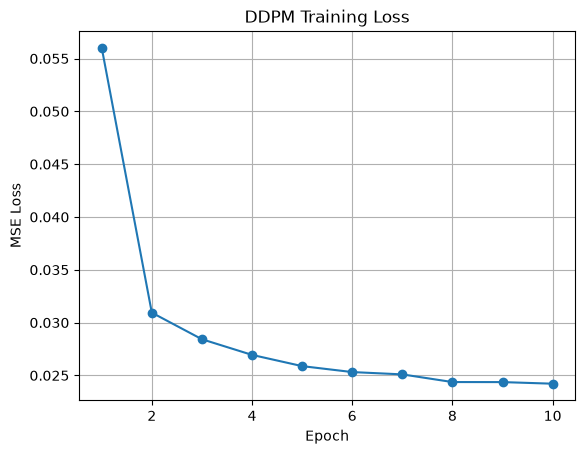

The noise-prediction MSE decreased rapidly during the first few epochs and then gradually stabilized around the low `0.02` range.

Although the model was intentionally undertrained, this was sufficient to produce recognizable MNIST-like samples.

---

## 1.2 Baseline Generation

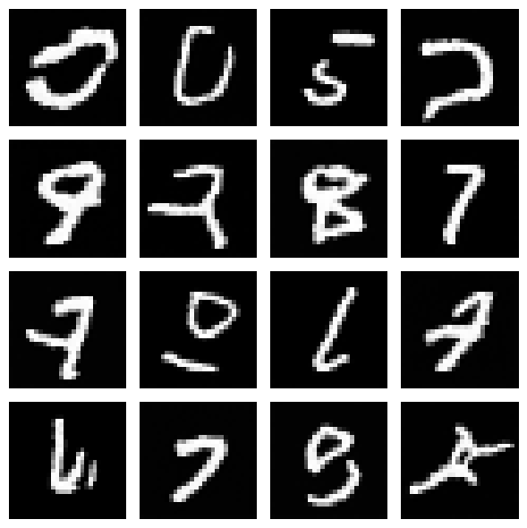

The baseline DDPM successfully generates recognizable digits from Gaussian noise.

Some samples remain ambiguous or distorted, which is expected given the small architecture and short training schedule.

A second set of generated baseline samples is shown below.

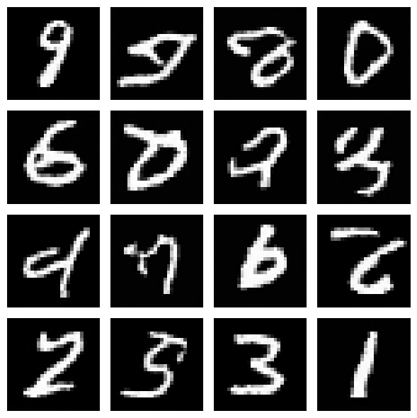

At this stage, the project was still simply a **DDPM implementation exercise**.

---

## 1.3 Watching the Reverse Diffusion Process

One of the interesting properties of diffusion models is that generation can be inspected as a trajectory rather than only through the final output.

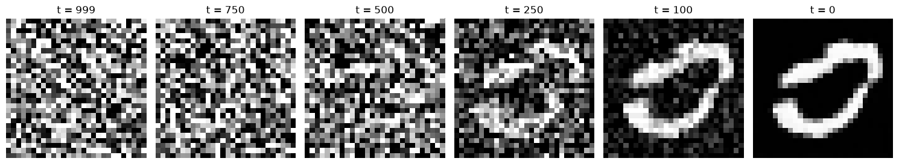

A single sample evolves approximately as

```text
Gaussian Noise
     │
     ▼
  t = 999
     │
     ▼
  t = 750
     │
     ▼
  t = 500
     │
     ▼
  t = 250
     │
     ▼
  t = 100
     │
     ▼
  t = 0
     │
     ▼
Generated Digit
```

Watching this sequential transformation led to the next question:

> **If generation itself is a sequential stochastic process, can it be treated as a reinforcement-learning trajectory?**

---

# 2. Adding Reinforcement Learning

The DDPM reverse process can be written as

$$
x_T
\rightarrow
x_{T-1}
\rightarrow
\cdots
\rightarrow
x_0.
$$

Each reverse transition follows

$$[
p_\theta(x_{t-1}\mid x_t)] $$
=

$$\mathcal{N}
\left(
\mu_\theta(x_t,t),
\sigma_t^2 I
\right).
$$

This suggests a simple RL interpretation:

```text
State
 x_t
  │
  ▼
DDPM Policy
  │
  ▼
pθ(x_{t-1} | x_t)
  │
  ▼
Next State
x_{t-1}
  │
  ▼
 ...
  │
  ▼
Final Image
 x_0
  │
  ▼
Reward
```

Instead of viewing the DDPM only as a noise predictor, I treated its reverse transition distribution as a **stochastic policy**.

PPO was then used to fine-tune this pretrained policy.

---

# 3. Reward Model

A separate CNN classifier was trained on MNIST.

Its test accuracy reached approximately:

```text
98.96%
```

For a generated image $x_0$, the reward was defined as

$$[
R(x_0)] $$
=

$$ \max_k P(y=k\mid x_0).
$$

In other words, a generated image receives a high reward when the classifier is confident that it belongs to one of the MNIST classes.

This reward was deliberately simple.

The purpose was not to design an optimal perceptual reward model, but to observe how introducing a terminal reward through PPO affects the diffusion process.

---

## 4. PPO Formulation

For each reverse transition, the Gaussian transition probability is interpreted as the policy probability.

The PPO probability ratio compares the probability of the same transition under the updated policy and the old policy.

First, the log-probability under the updated policy is

$$
\log p_\theta(x_{t-1}\mid x_t)
$$

and the log-probability under the old policy is

$$
\log p_{\theta_{\mathrm{old}}}(x_{t-1}\mid x_t).
$$

Their difference is

$$
\log p_\theta(x_{t-1}\mid x_t) $$
-
$$
\log p_{\theta_{\mathrm{old}}}(x_{t-1}\mid x_t).
$$

The PPO probability ratio is then

$$
r_t(\theta) $$
=
$$
\exp
\left(
\log p_\theta(x_{t-1}\mid x_t) $$
-
$$
\log p_{\theta_{\mathrm{old}}}(x_{t-1}\mid x_t)
\right).
$$

The unclipped policy objective is

$$
r_t(\theta)A_t.
$$

The clipped probability ratio is

$$
\operatorname{clip}
\left(
r_t(\theta),
1-\epsilon,
1+\epsilon
\right).
$$

Therefore, the clipped objective becomes

$$
\operatorname{clip}
\left(
r_t(\theta),
1-\epsilon,
1+\epsilon
\right)A_t.
$$

Finally, PPO takes the minimum between the unclipped and clipped objectives:

$$
\mathcal{L}_{\mathrm{PPO}}
=
\mathbb{E}
\left[
\min
\left(
r_t(\theta)A_t,
\operatorname{clip}
\left(
r_t(\theta),
1-\epsilon,
1+\epsilon
\right)A_t
\right)
\right].
$$

A separate value network estimates the expected terminal reward:

$$
V_\phi(x_t,t)
$$

with the target

$$
V_\phi(x_t,t)
\approx
\mathbb{E}[R(x_0)\mid x_t].
$$

The simplified advantage used in this experiment is

$$
A_t
=
R(x_0)
-
V_\phi(x_t,t).
$$

# 5. PPO Experiment Setup

The PPO experiment can be summarized as:

```text
Pretrained DDPM
      │
      ▼
Sample reverse trajectory
      │
      ▼
x_T → x_{T-1} → ... → x_0
      │
      ▼
CNN Reward Model
      │
      ▼
R(x_0)
      │
      ├───────────────┐
      ▼               ▼
  Advantage       Value Loss
      │
      ▼
PPO Policy Update
      │
      ▼
Updated DDPM
```

During trajectory collection, reverse-process transitions were stored together with their old policy log-probabilities.

The PPO update then recomputed the transition probability under the updated diffusion model and applied the clipped objective.

---

# 6. PPO Training Result

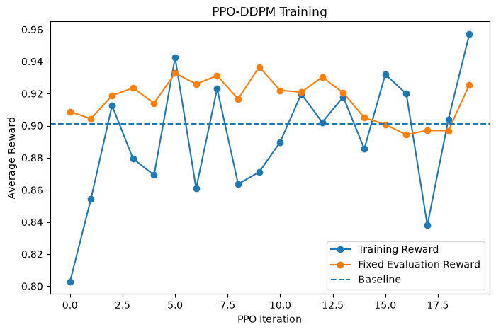

The blue curve represents the reward obtained from newly sampled training trajectories.

Because every PPO iteration samples new stochastic diffusion trajectories from a relatively small batch, the training reward fluctuates considerably.

The orange curve represents evaluation using fixed initial noise and is substantially more stable.

The fixed evaluation reward frequently exceeds the baseline reward, indicating that PPO did modify the policy in a reward-improving direction for some iterations.

However, the reward does **not** continuously increase.

Therefore, the result should not be interpreted simply as:

> PPO continuously improves DDPM generation quality.

Instead, PPO changes the diffusion policy under the chosen classifier-confidence objective.

The next question was whether reward improvement captured the full behavioral change.

---

# 7. Evaluation on 1,000 Generated Samples

To obtain a broader comparison, I generated **1,000 samples** from both the baseline and PPO models.

The classifier-confidence rewards were:

| Model | Mean Reward | Std. Reward |
|---|---:|---:|
| Baseline DDPM | 0.9154 | 0.1475 |
| PPO-DDPM | **0.9203** | **0.1461** |

The average reward increased by approximately

$$
\Delta R
=
0.9203-0.9154
\approx
0.0049.
$$

The optimized reward therefore improved, but only modestly.

However, examining the generated class distribution revealed a much larger behavioral change.

---

# 8. Generated Class Distribution

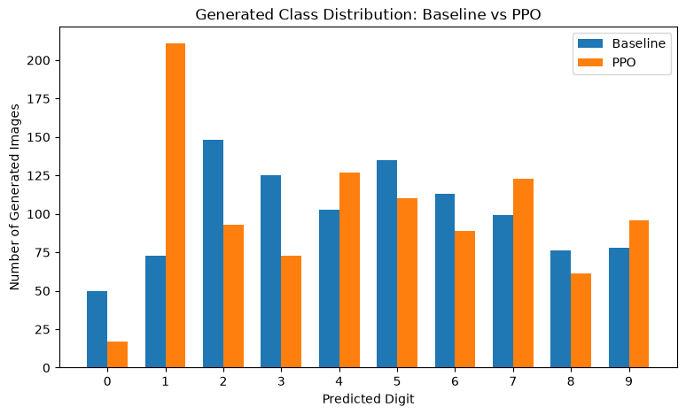

The predicted class counts for 1,000 generated samples were:

| Digit | Baseline | PPO |
|---:|---:|---:|
| 0 | 50 | 17 |
| 1 | 73 | **211** |
| 2 | 148 | 93 |
| 3 | 125 | 73 |
| 4 | 103 | 127 |
| 5 | 135 | 110 |
| 6 | 113 | 89 |
| 7 | 99 | 123 |
| 8 | 76 | 61 |
| 9 | 78 | 96 |

The most striking change occurs for digit `1`:

$$
73
\rightarrow
211.
$$

Its proportion increases from

$$
7.3\%
\rightarrow
21.1\%.
$$

This is a much larger change than the improvement in mean reward.

The observed behavior is therefore closer to:

```text
                    PPO
                     │
          ┌──────────┴──────────┐
          ▼                     ▼
Mean classifier          Generated class
reward ↑ slightly        distribution shifts
```

The reward contains no explicit constraint for maintaining class balance or generation diversity.

Therefore, optimizing classifier confidence can change the generative distribution.

One possible hypothesis is that PPO discovered particular image structures that provide an easier route toward high classifier confidence.

However, this experiment does **not** establish why digit `1` specifically became more frequent.

---

# 9. Looking Beyond the Final Image

The distribution shift raised a more interesting question.

> **What exactly did PPO change inside the denoising process?**

A diffusion model does not generate an image in one step.

Its output is the result of a long trajectory:

$$
x_T
\rightarrow
x_{T-1}
\rightarrow
\cdots
\rightarrow
x_0.
$$

If PPO changes the final generated class, then it is useful to ask:

> **When and how do the baseline and PPO trajectories begin to diverge?**

---

# 10. Why Fixing Only the Initial Noise Is Not Enough

A DDPM reverse step is stochastic:

$$
x_{t-1}
=
\mu_\theta(x_t,t)
+
\sigma_t z_t,
\qquad
z_t\sim\mathcal{N}(0,I).
$$

Suppose the baseline and PPO models start from the same initial noise:

$$
x_T^{\mathrm{Base}}
=
x_T^{\mathrm{PPO}}.
$$

If they independently sample different reverse noise,

$$
z_t^{\mathrm{Base}}
\neq
z_t^{\mathrm{PPO}},
$$

their trajectories can diverge simply because of sampling randomness.

That would make it difficult to isolate the effect of PPO.

---

# 11. Controlled Trajectory Experiment

To make the comparison more controlled, I fixed both:

1. the initial Gaussian noise $x_T$
2. the reverse-process noise $z_t$ at every timestep

Therefore,

$$
x_T^{\mathrm{Base}}
=
x_T^{\mathrm{PPO}}
$$

and

$$
z_t^{\mathrm{Base}}
=
z_t^{\mathrm{PPO}}
\qquad
\forall t.
$$

Conceptually:

```text
                  SAME x_T
                     │
          ┌──────────┴──────────┐
          │                     │
      Baseline                PPO
          │                     │
          └──── SAME z_t ───────┘
          │                     │
          ▼                     ▼
       x_{t-1}^B             x_{t-1}^P
          │                     │
          └──── SAME z_{t-1} ───┘
          │                     │
          ▼                     ▼
         ...                   ...
          │                     │
          ▼                     ▼
        x_0^B                 x_0^P
```

The repository contains the fixed random variables used for this comparison:

```text
initial_noise.pt
trajectory_reverse_noises.pt
```

Under these matched stochastic conditions, differences between the trajectories arise from the changed denoising model and the subsequent propagation of those state differences.

---

# 12. Same Noise, Different Final Generation

One controlled sample produced a particularly interesting result.

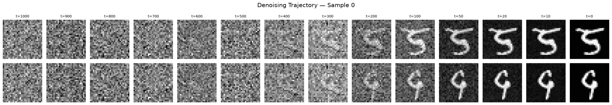

Both models begin from the same initial noise and receive the same reverse-process noise at every timestep.

Yet the final outputs are:

```text
Baseline DDPM  →  5
PPO-DDPM       →  9
```

At high-noise timesteps, the trajectories are visually difficult to distinguish.

As denoising progresses, however, different structures gradually emerge.

This sample was selected for more detailed trajectory analysis.

---

# 13. Detailed Denoising Trajectory

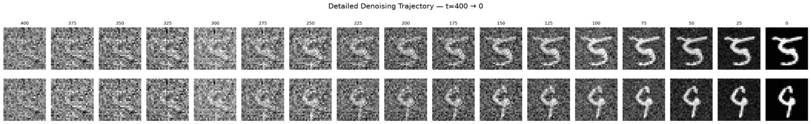

The later part of the trajectory was saved at finer intervals:

$$
t=400,375,350,\ldots,25,0.
$$

At approximately $t=250$ to $t=200$, the states remain noisy, but structural differences become increasingly visible.

By approximately $t=150$ to $t=100$, the baseline and PPO trajectories visually resemble different digit structures much more clearly.

However, visual inspection alone cannot identify an exact semantic divergence point.

So the interval was inspected more closely.

---

# 14. Zooming Into the Noisy Region

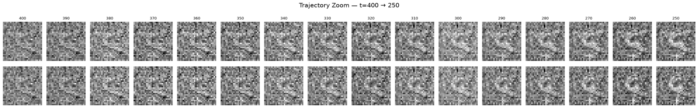

The interval

$$
t=400 \rightarrow 250
$$

was examined at increments of 10 timesteps.

Directly comparing the raw $x_t$ states remained difficult because both trajectories still contain substantial noise.

This motivated a different question:

> Instead of asking what each noisy state looks like, **where are the two states different?**

---

# 15. Difference Maps

For each selected timestep, I calculated the absolute pixel-space difference

$$
\Delta_t
=
\left|
x_t^{\mathrm{PPO}}
-
x_t^{\mathrm{Baseline}}
\right|.
$$

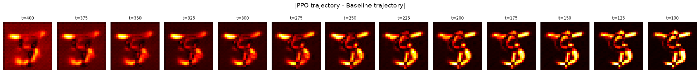

The difference maps reveal spatial structure that is difficult to see in the raw trajectories.

However, the first visualization introduced another problem.

Each subplot was automatically normalized using its own value range.

As a result, a very small difference at $t=400$ could appear visually as bright as a much larger difference at $t=100$.

This can exaggerate early differences.

---

# 16. Shared-Scale Difference Map

To compare the magnitude of the difference across timesteps, I replotted every heatmap using a **single shared color scale**.

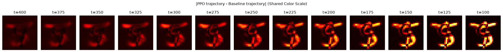

The interpretation becomes much clearer.

```text
t = 400
weak but spatially structured difference
              │
              ▼
t = 350–300
difference gradually strengthens
              │
              ▼
t = 275–250
structured difference becomes clearer
              │
              ▼
t = 225–175
difference strongly amplifies
              │
              ▼
t = 150–100
large stroke-shaped differences
```

The difference does not suddenly appear at one timestep.

Instead, the pixel-space difference appears to be **progressively amplified during denoising**.

Importantly, this does not mean that the semantic `5` versus `9` decision was already made at $t=400$.

The heatmap measures pixel-space differences, not semantic identity.

---

# 17. Quantifying Trajectory Divergence

To quantify the observation, I calculated the MSE between the two trajectory states:

$$
D_t
=
\operatorname{MSE}
\left(
x_t^{\mathrm{PPO}},
x_t^{\mathrm{Baseline}}
\right).
$$

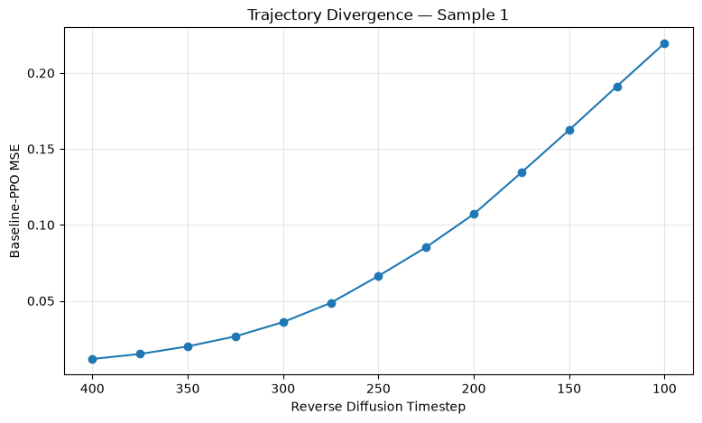

For the selected sample:

| Timestep | Baseline–PPO MSE |
|---:|---:|
| 400 | ~0.011 |
| 375 | ~0.014 |
| 350 | ~0.020 |
| 325 | ~0.026 |
| 300 | ~0.036 |
| 275 | ~0.048 |
| 250 | ~0.066 |
| 225 | ~0.085 |
| 200 | ~0.107 |
| 175 | ~0.135 |
| 150 | ~0.162 |
| 125 | ~0.191 |
| 100 | ~0.220 |

The curve increases smoothly rather than exhibiting one obvious discontinuity.

For this sample, the observed behavior is therefore closer to

$$
\text{small difference}
\rightarrow
\text{accumulation}
\rightarrow
\text{amplification}
\rightarrow
\text{different final structure}.
$$

---

# 18. Why Can a Small Difference Grow?

The reverse-process mean depends on the model's predicted noise.

Suppose PPO introduces a small difference:

$$
\Delta\epsilon_t
=
\epsilon_{\theta_{\mathrm{PPO}}}(x_t,t)
-
\epsilon_{\theta_{\mathrm{Base}}}(x_t,t).
$$

This changes the reverse transition and therefore the next state:

$$
\Delta\epsilon_t
\rightarrow
\Delta x_{t-1}.
$$

At the following timestep, the models are now operating on slightly different states.

That can create another difference in the predicted noise:

$$
\Delta x_{t-1}
\rightarrow
\Delta\epsilon_{t-1}.
$$

The process can therefore propagate recursively:

$$
\boxed{
\Delta\epsilon_t
\rightarrow
\Delta x_{t-1}
\rightarrow
\Delta\epsilon_{t-1}
\rightarrow
\Delta x_{t-2}
\rightarrow
\cdots
\rightarrow
\Delta x_0
}
$$

This provides one interpretation of the smooth increase observed in the trajectory MSE.

A small policy modification affects one reverse step, which changes the input state at the following step, allowing the difference to accumulate throughout denoising.

---

# 19. What Did PPO Actually Change?

The experiment started with a terminal objective:

$$
R(x_0).
$$

But PPO does not directly modify only the final image.

It changes the transition policy

$$
p_\theta(x_{t-1}\mid x_t)
$$

throughout the reverse process.

Therefore:

```text
Final Reward
     │
     ▼
 PPO Update
     │
     ▼
Reverse Transition Policy Changes
     │
     ▼
Trajectory Changes
     │
     ▼
Future States Change
     │
     ▼
Future Noise Predictions Change
     │
     ▼
Final Generation Changes
```

This helps explain why a relatively small change in average reward can coexist with a substantial change in generative behavior.

---

# 20. Main Observations

The experiment produced four main observations.

### 1. PPO slightly improved the chosen reward

$$
0.9154
\rightarrow
0.9203.
$$

### 2. The generated distribution changed substantially

For digit `1`:

$$
7.3\%
\rightarrow
21.1\%.
$$

### 3. Baseline and PPO can follow different trajectories under matched stochastic conditions

For the selected sample:

```text
Baseline → 5
PPO      → 9
```

### 4. Pixel-space trajectory divergence increased progressively

The MSE increased from approximately

$$
0.011
\quad\text{at }t=400
$$

to

$$
0.220
\quad\text{at }t=100.
$$

Together, these results suggest:

$$
\boxed{
\text{small reward change}
\not\Rightarrow
\text{small generative behavior change}
}
$$

and

$$
\boxed{
\text{reward improvement}
\neq
\text{distribution preservation}.
}
$$

---

# 21. Limitations

This is an exploratory MNIST-scale experiment rather than a general result about reinforcement learning for diffusion models.

### Simple reward

The reward is only classifier confidence:

$$
R(x_0)
=
\max_k P(y=k\mid x_0).
$$

It does not directly measure:

- perceptual quality
- diversity
- class balance
- similarity to the original DDPM distribution

The reward can therefore encourage unintended behavior.

### Reward-model bias

Digit `1` became substantially more frequent after PPO.

The current experiment cannot determine whether this comes from classifier calibration, the baseline DDPM distribution, digit complexity, PPO optimization, or another factor.

### Simplified PPO

The implementation is intentionally lightweight and uses a simplified terminal-reward value formulation rather than a diffusion-specific RL framework.

### MNIST-scale experiment

MNIST and the small U-Net make the trajectories easy to inspect, but the observations cannot automatically be generalized to modern large-scale diffusion models.

### Pixel-space distance is not semantic distance

The MSE analysis measures how different two intermediate states are.

It does not tell us exactly when their semantic interpretation becomes `5` versus `9`.

### Detailed analysis of one selected trajectory

The trajectory visualization provides a concrete example, but one selected `5 → 9` trajectory is not enough to establish a general pattern.

A larger trajectory-level analysis is required.

---

# 22. Next Steps

The next step is to move from **pixel-space trajectory analysis** toward **semantic trajectory analysis**.

## 22.1 Predicted Clean Image at Each Timestep

At any timestep, the model's predicted clean image can be estimated as

$$
\hat{x}_0^{(t)}
=
\frac{
x_t
-
\sqrt{1-\bar{\alpha}_t}
\epsilon_\theta(x_t,t)
}{
\sqrt{\bar{\alpha}_t}
}.
$$

Instead of asking only

> How different are the noisy states?

we can ask

> **What clean image does each model currently predict this trajectory will become?**

Conceptually:

```text
t        Baseline x̂₀        PPO x̂₀

400           ?                 ?
350           ?                 ?
300           ?                 ?
250        5-like?           9-like?
200           5                 9
150           5                 9
...
0             5                 9
```

This could help distinguish

```text
Pixel-space divergence
"When do x_t states become different?"
```

from

```text
Semantic divergence
"When do the predicted final structures become different?"
```

---

## 22.2 Analyze Many Controlled Trajectories

The same experiment can be repeated across many initial noises.

Possible measurements include:

- trajectory MSE
- final class-change frequency
- semantic divergence timestep
- reward difference
- feature-space trajectory distance
- relationship between trajectory divergence and final class change

This would test whether progressive divergence is a general phenomenon or mainly a property of selected samples.

---

## 22.3 Better Reward Design

The current reward could be extended with additional constraints:

$$
R
=
R_{\mathrm{confidence}}
+
\lambda_1R_{\mathrm{diversity}}
+
\lambda_2R_{\mathrm{distribution}}.
$$

This could test whether PPO can improve a desired objective while preserving more of the original generative distribution.

---

## 22.4 Beyond MNIST

The same idea could eventually be explored on more complex datasets and diffusion architectures.

With richer images, trajectory changes could be analyzed not only through class identity but also through:

- local structures
- object parts
- visual attributes
- semantic features
- feature-space representations

---

# 23. Repository Structure

```text
DDPM-with-PPO--MNIST/
│
├── DDPM.ipynb
├── README.md
│
├── assets/
│   ├── ddpm_training_loss.png
│   ├── ddpm_baseline_samples_1.png
│   ├── ddpm_baseline_samples_2.png
│   ├── ddpm_denoising_process.png
│   ├── ppo_training.png
│   ├── class_distribution.png
│   ├── full_trajectory.png
│   ├── detailed_trajectory.png
│   ├── trajectory_zoom.png
│   ├── trajectory_difference_autoscale.png
│   ├── trajectory_difference_shared.png
│   └── trajectory_mse.png
│
├── ddpm_baseline.pth
├── mnist_reward_model.pth
├── baseline_samples.pt
├── initial_noise.pt
├── trajectory_reverse_noises.pt
├── baseline_trajectory.pt
├── ppo_trajectory.pt
├── baseline_detailed_trajectory.pt
└── ppo_detailed_trajectory.pt
```

---

# Final Takeaway

This project started as a small exercise to understand DDPM by implementing it from scratch.

Then I asked:

> **What happens if reinforcement learning is added to the reverse diffusion process?**

PPO provided a simple way to explore that question.

The reward increased only slightly, while the generated class distribution changed substantially.

That observation motivated a deeper analysis of the denoising process itself.

By fixing both the initial noise and every reverse-process noise term, I compared the baseline and PPO models under matched stochastic conditions.

For one selected trajectory, the two models eventually generated different digits:

```text
Baseline → 5
PPO      → 9
```

Difference maps and trajectory MSE showed that their states did not separate at one obvious timestep. Instead, the difference progressively increased throughout later denoising.

The project therefore evolved from

```text
Implement DDPM
```

to

```text
Implement DDPM
      ↓
Add PPO
      ↓
Observe reward change
      ↓
Discover distribution shift
      ↓
Control sampling randomness
      ↓
Analyze denoising trajectories
      ↓
Measure progressive divergence
```

The most interesting lesson was that the effect of reinforcement learning on a diffusion model may not be fully understood from its final reward or final generated image alone.

**The denoising trajectory itself can be an object of analysis.**
